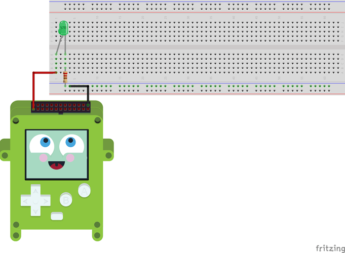

# Tutorial_Blinky - flashing a LED light through the PEX connector

## Idea of this tutorial
* Pokitto has an extension header called the PEX (Pokitto EXtension).
* In this example, we will use the PEX header to control a LED light.
* The anode (+) of the LED is connected to EXT0 (red wire) and the cathode (-) to Ground through a current-limiting resistor
* You will also learn to read the Pokitto buttons to turn the LED on and off 

## Programming for Pokitto hardware with FemtoIDE

* Pokitto has a full programming environment called FemtoIDE (by Felipe Manga)
* FemtoIDE works in Windows, Linux, MacOS (also beta test version available for RaspberryPi)
* get FemtoIDE release for your operating system from [https://github.com/felipemanga/FemtoIDE/releases](https://github.com/felipemanga/FemtoIDE/releases)

## Opening this tutorial in FemtoIDE

* get the tutorials package from the Github repository [https://github.com/pokitto/ProgrammingTutorials](https://github.com/pokitto/ProgrammingTutorials)
* extract / download the repository so that the tutorial folders are in the following path: (your femto installation)/projects
* when you launch FemtoIDE, the tutorials projects should be visible in the FemtoIDE opening screen  

## Useful links

* original article for this tutorial (by Pharap) [https://talk.pokitto.com/t/wiki-using-the-pex-01-a-simple-led-project/613/1](https://talk.pokitto.com/t/wiki-using-the-pex-01-a-simple-led-project/613/1)

