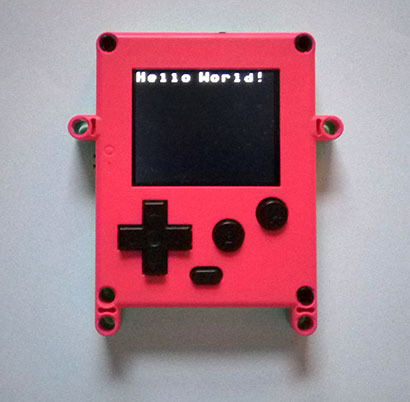

# Tutorial_HelloWorld - print "Hello World!" on Pokitto screen

## Idea of this tutorial
* putting text on Pokitto screen
* This tutorial will also work fully in the Pokitto Simulator & Emulator - no need for hardware!

## Programming for Pokitto hardware with FemtoIDE

* Pokitto has a full programming environment called FemtoIDE (by Felipe Manga)
* FemtoIDE works in Windows, Linux, MacOS (also beta test version available for RaspberryPi)
* get FemtoIDE release for your operating system from [https://github.com/felipemanga/FemtoIDE/releases](https://github.com/felipemanga/FemtoIDE/releases)

## Opening this tutorial in FemtoIDE

* get the tutorials package from the Github repository [https://github.com/pokitto/ProgrammingTutorials](https://github.com/pokitto/ProgrammingTutorials)
* extract / download the repository so that the tutorial folders are in the following path: (your femto installation)/projects
* when you launch FemtoIDE, the tutorials projects should be visible in the FemtoIDE opening screen  

